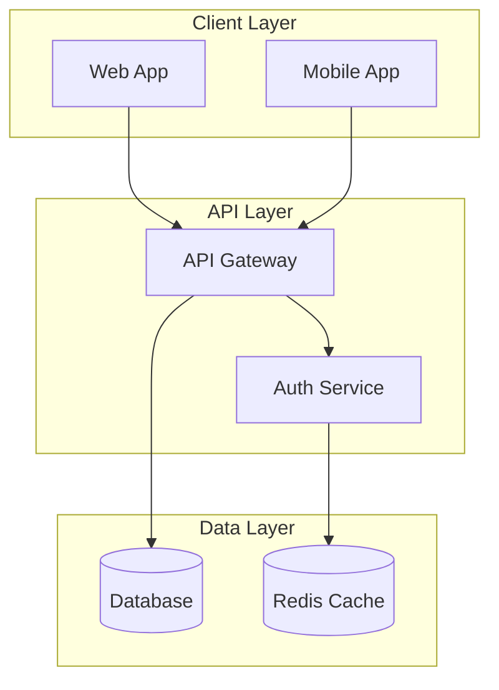
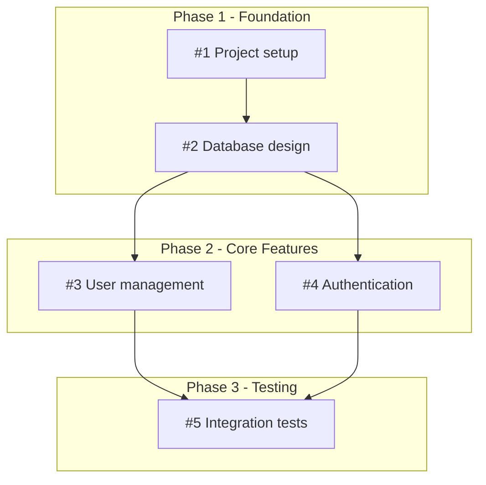
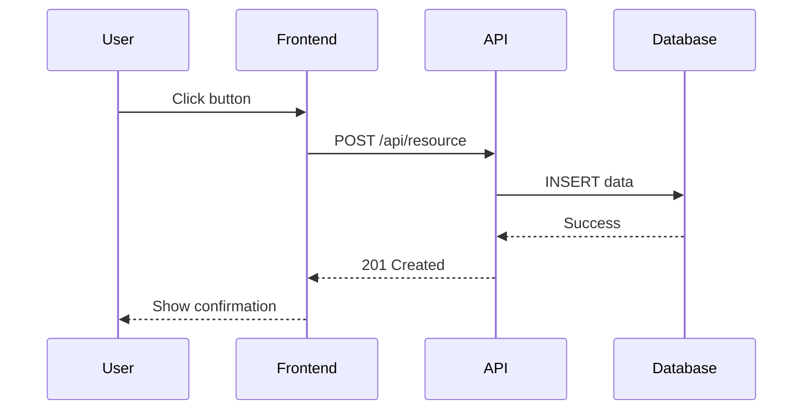
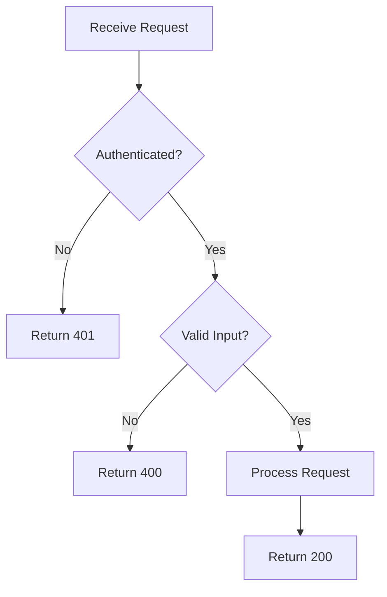

Visualization skills generate Mermaid diagrams for architecture, dependencies, and other visual representations that render directly in GitHub.

## architecture-diagramming

Generate Mermaid architecture diagrams showing system components, layers, and data flows.

**Triggers:**
- "Show me the system architecture"
- "Diagram the components"
- "Create an architecture diagram"
- During project planning to visualize system design

**Tools Used:**
- `read_project_file` - Read existing code to understand structure
- `get_project_architecture` - Get analyzed architecture summary
- `add_note` - Save diagram to project notes
- `list_project_directory` - Explore project structure

**Key Features:**
- Generates GitHub-compatible Mermaid flowcharts
- Shows system overview, layered architecture, request flows, and microservices
- Uses subgraphs to group related components
- Follows strict syntax rules for reliable rendering

**Diagram Patterns:**

| Pattern | Use Case |
|---------|----------|
| System Overview | Major components and relationships |
| Layered Architecture | Horizontal layers with boundaries |
| Request Flow | How requests flow through system |
| Microservices | Service boundaries and communication |

**Mermaid Syntax Rules:**

The skill enforces these critical rules for GitHub compatibility:

1. **Never use parentheses inside labels** - causes rendering errors
   - Wrong: `A[Component (main)]`
   - Correct: `A[Component - main]`

2. **Always match brackets** - each shape uses specific brackets
   - `[Rectangle]` - Standard component
   - `{Diamond}` - Decision point
   - `[(Database)]` - Cylinder for data stores
   - `((Circle))` - Circle node

**Example Output:**



---

## dependency-mapping

Generate Mermaid dependency graphs showing issue relationships, blocking chains, and critical paths.

**Triggers:**
- "Show me the dependencies"
- "Map the issue dependencies"
- "What issues block other issues?"
- After issue decomposition to visualize relationships

**Tools Used:**
- `list_github_issues` - Get all open issues
- `get_github_issue_with_comments` - Get full issue details
- `search_github_issues` - Find specific issues
- `add_note` - Save dependency graph

**Key Features:**
- Parses dependency keywords from issue bodies and labels
- Identifies blocking relationships and parallel opportunities
- Highlights critical path with styling
- Groups issues by phase using subgraphs

**Dependency Detection:**

The skill looks for these patterns in issue bodies:

| Pattern | Meaning |
|---------|---------|
| "Blocked by #X" | This issue depends on #X |
| "Depends on #X" | This issue depends on #X |
| "After #X" | Do this after #X |
| "Blocks #X" | This must complete before #X |

**Arrow Types:**

| Arrow | Use |
|-------|-----|
| `-->` | Standard dependency |
| `==>` | Critical path |
| `-.->` | Soft/optional dependency |

**Example Output:**



---

## mermaid-diagrams

Guide for creating syntactically correct Mermaid diagrams that render properly on GitHub and other platforms.

**Triggers:**
- When creating flowcharts, sequence diagrams, or any visual diagrams
- Generating documentation with diagrams
- Creating architecture or process visualizations

**Key Features:**
- Comprehensive syntax reference for all Mermaid diagram types
- Critical rules for GitHub compatibility
- Examples for common patterns

**Supported Diagram Types:**

| Type | Use Case |
|------|----------|
| Flowchart | Process flows, decision trees, algorithms |
| Sequence Diagram | API calls, user interactions |
| Class Diagram | Object relationships, schemas |
| State Diagram | State machines, workflows |
| ER Diagram | Database design |
| Gantt Chart | Project timelines |
| Git Graph | Branch strategies |

**Critical Syntax Rules:**

1. **Never use parentheses in labels**
   ```mermaid
   flowchart TD
     A[Start agent loop - beginning]  %% Correct
     B[Start agent loop]              %% Correct
     %% WRONG: C[Start agent loop (beginning)]
   ```

2. **Always match opening and closing brackets**
   ```mermaid
   flowchart TD
     A[Rectangle]    %% Correct
     B{Diamond}      %% Correct
     %% WRONG: C{Diamond]
   ```

**Node Shapes:**

| Syntax | Shape |
|--------|-------|
| `[Text]` | Rectangle |
| `(Text)` | Rounded edges |
| `{Text}` | Diamond |
| `([Text])` | Stadium/pill |
| `[[Text]]` | Subroutine |
| `[(Text)]` | Cylinder/database |
| `((Text))` | Circle |

**Arrow Types:**

| Syntax | Style |
|--------|-------|
| `-->` | Solid arrow |
| `-.->` | Dotted arrow |
| `==>` | Thick arrow |
| `--text-->` | Labeled arrow |
| `---` | Line (no arrow) |

**Common Patterns:**

API Flow:


Decision Flow:


**Best Practices:**

- Keep it simple: 5-15 components per diagram
- Use subgraphs to group related components
- Show data flow direction with arrows
- Label relationships when meaning is not obvious
- Break complex systems into multiple diagrams
- Test rendering in your target environment
