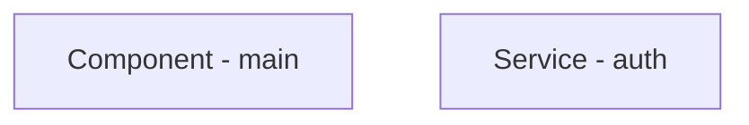
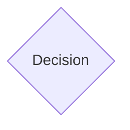
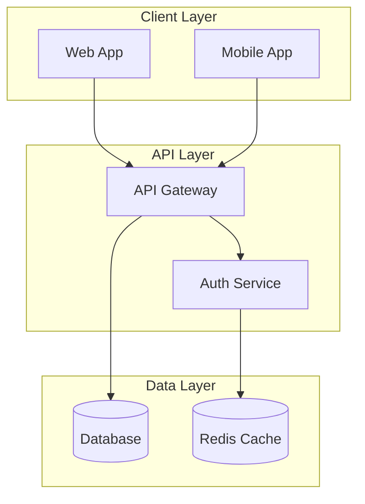
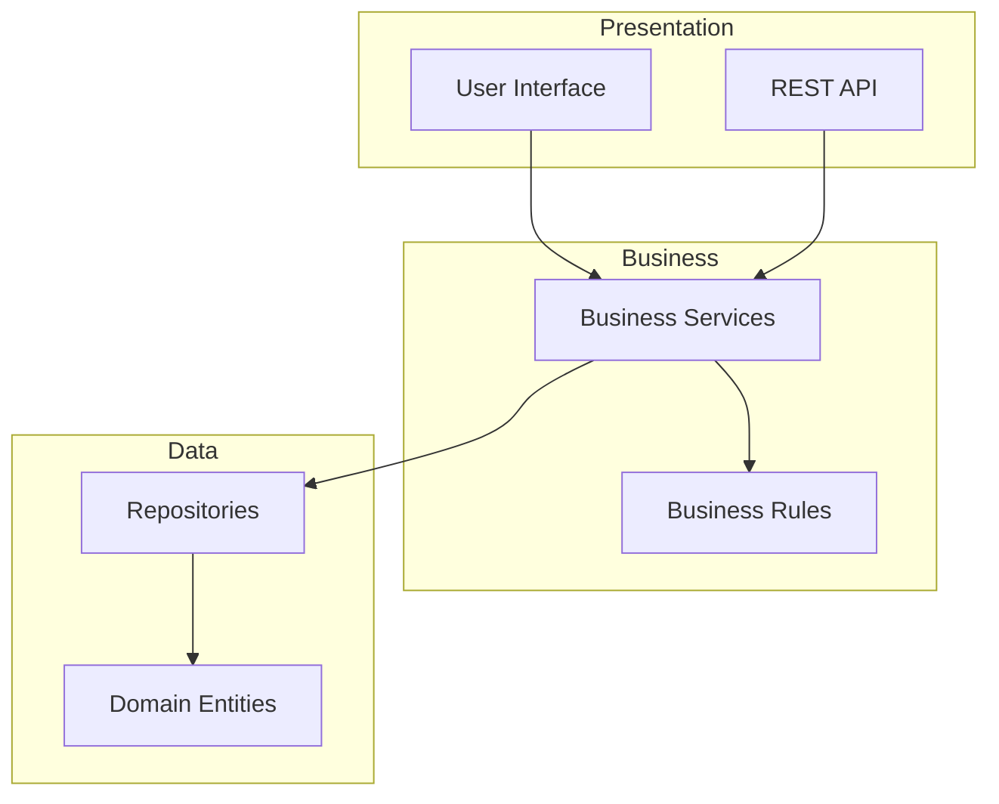
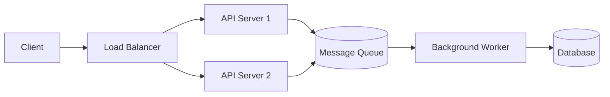
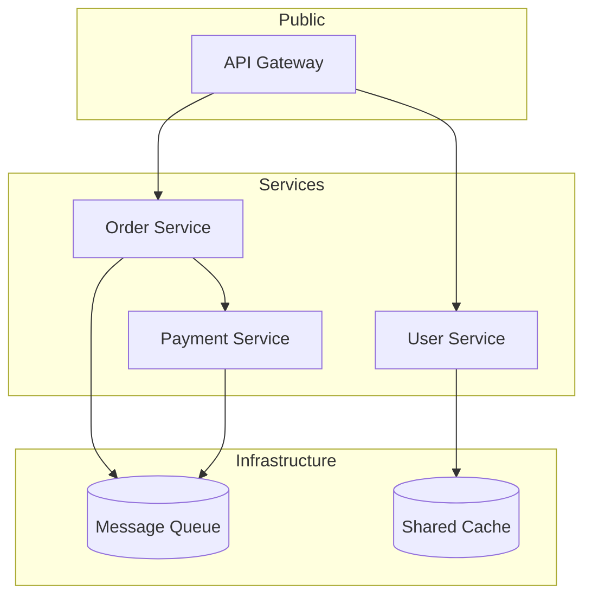
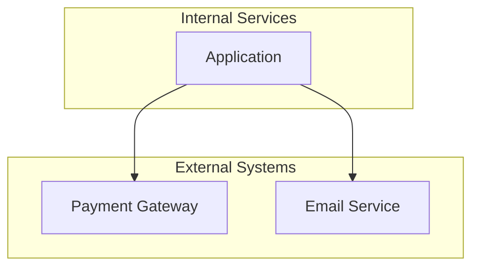
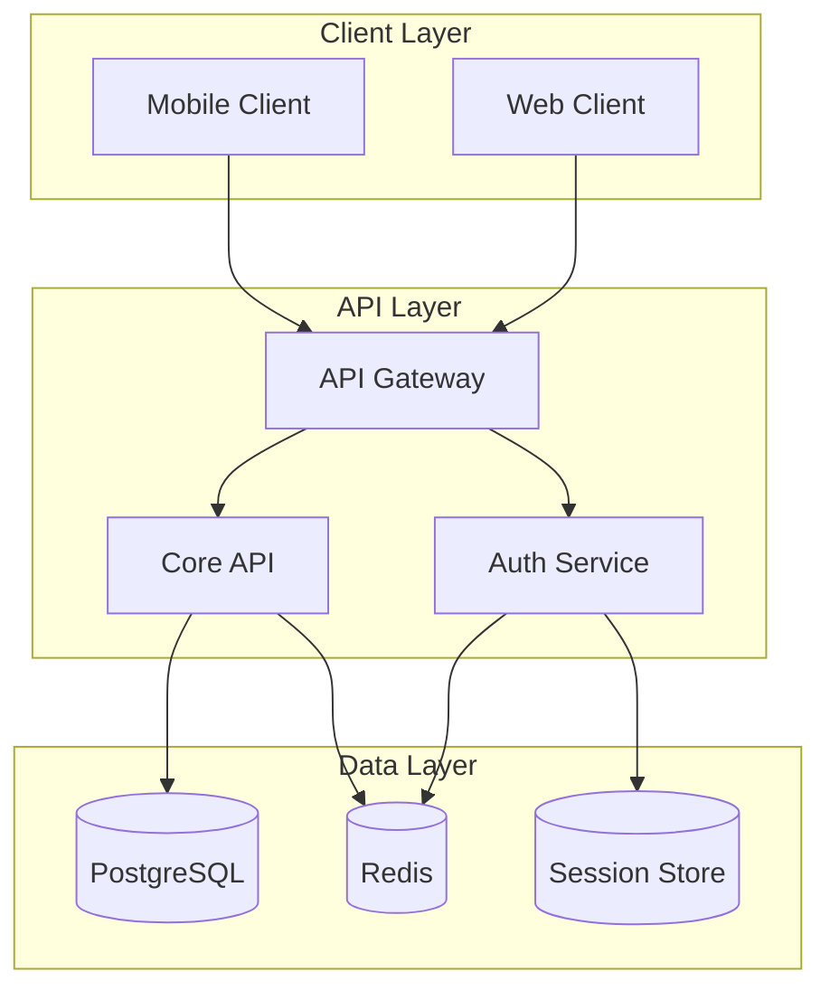

# Architecture Diagramming Skill

Generate clear, GitHub-compatible Mermaid architecture diagrams that visualize system components, layers, boundaries, and data flows.

## When to Use

Activate this skill when:
- User asks for an architecture diagram
- User says "show me the system architecture", "diagram the components"
- During project planning to visualize the system design
- When explaining how components interact

## Available Tools

| Tool | Purpose |
|------|---------|
| `read_project_file` | Read existing code to understand structure |
| `get_project_scan` | Get cached project scan with structure and language data |
| `add_note` | Save diagram to project notes |
| `list_project_directory` | Explore project structure |

## CRITICAL: Mermaid Syntax Rules

### NEVER use parentheses inside labels

Parentheses in Mermaid labels cause rendering errors on GitHub.

**WRONG - Will break:**
```mermaid
flowchart TD
    A[Component (main)]
    B[Service (auth)]
```

**CORRECT - Use dashes or commas:**


### ALWAYS ensure matching brackets

Each node shape uses specific brackets that must match:
- `[Rectangle]` - Standard component
- `{Diamond}` - Decision point
- `([Stadium])` - Pill shape
- `[(Database)]` - Cylinder for data stores
- `((Circle))` - Circle node

**WRONG:**
```mermaid
flowchart TD
    A{Decision]
```

**CORRECT:**


## Diagram Patterns

### System Overview

Show major components and their relationships:



### Layered Architecture

Show horizontal layers with clear boundaries:



### Request Flow

Show how a request flows through the system:



### Microservices

Show service boundaries and communication:



## Architecture Analysis Process

### Step 1: Identify Components
- What are the major modules or services?
- What external systems are involved?
- What data stores are used?

### Step 2: Determine Layers
Common layers to consider:
- **Presentation**: UI, API endpoints
- **Business**: Core logic, workflows
- **Data**: Repositories, entities
- **Infrastructure**: External services, queues

### Step 3: Map Relationships
- Request/response flows
- Data dependencies
- Event/message flows
- Shared resources

### Step 4: Apply Boundaries
Use subgraphs to show:
- Team ownership
- Deployment units
- Security boundaries
- Scalability zones

### Step 5: Generate Diagram
Create a clean Mermaid diagram that:
- Fits on one screen when possible
- Uses consistent naming
- Shows data flow direction
- Groups related components

## Node Naming Conventions

Use clear, abbreviated names:
- `API` not `ApplicationProgrammingInterface`
- `Auth` not `AuthenticationService`
- `DB` or use `[(Name)]` for databases
- `Queue` or `MQ` for message queues

## Arrow Types

| Arrow | Meaning |
|-------|---------|
| `-->` | Standard request/response |
| `-.->` | Async or optional |
| `==>` | Critical path |
| `--text-->` | Labeled relationship |

## Subgraph Styling



## Best Practices

1. **Keep it simple** - 5-15 components max per diagram
2. **Use subgraphs** - Group related components
3. **Show data flow** - Arrows indicate direction
4. **Label relationships** - When meaning isn't obvious
5. **Avoid clutter** - Break complex systems into multiple diagrams
6. **Be consistent** - Same naming conventions throughout

## Example Output

Given a description of a "REST API with authentication and database":



## After Generating Diagram

- Offer to save the diagram to project notes
- Suggest adding to planning document
- Ask if user wants more detail in any area
- Recommend `dependency-mapping` for issue visualization
