# Mermaid Diagrams Skill

Use Mermaid syntax to create clear, maintainable diagrams directly in markdown. Mermaid diagrams are rendered by GitHub, GitLab, and many documentation tools.

## When to Use Mermaid

- **Flowcharts**: Process flows, decision trees, algorithms
- **Sequence Diagrams**: API calls, user interactions, system communication
- **Class Diagrams**: Object relationships, database schemas
- **State Diagrams**: State machines, workflow states
- **Entity Relationship Diagrams**: Database design
- **Gantt Charts**: Project timelines, task scheduling
- **Git Graphs**: Branch strategies, release flows

## IMPORTANT INSTRUCTIONS

### 1. NEVER use parentheses inside a label

**Using parentheses inside a label causes syntax errors when rendering on GitHub.**

**NEVER DO THIS:**
```mermaid
flowchart TD
  Start[Start agent loop (beginning)]
  Criteria[Define completion criteria checklist 3-5]
  ShowCriteria[Show criteria to user for approval]
  CriteriaOK{User approved (causes errors)}
```

**ALWAYS DO THIS INSTEAD:**
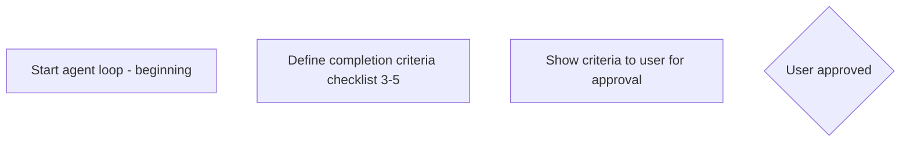

### 2. ALWAYS ensure that labels are wrapped in matching brackets

**Labels must have matching opening and closing brackets based on their shape.**

**CORRECT - Matching brackets:**
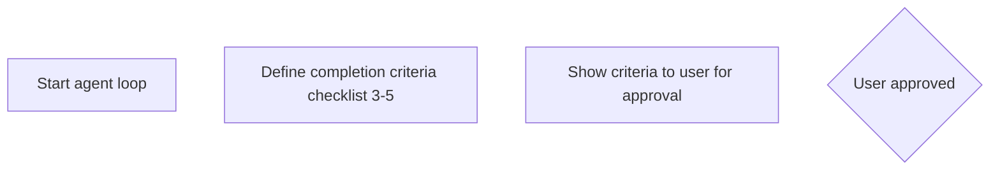

**INCORRECT - Mismatched brackets:**
```mermaid
flowchart TD
  Start[Start agent loop]
  Criteria[Define completion criteria checklist 3-5]
  ShowCriteria[Show criteria to user for approval]
  CriteriaOK{User approved]
```
Notice that the brackets do not match on the label for CriteriaOK (`{` opens but `]` closes).

## Basic Syntax Examples

### Flowchart
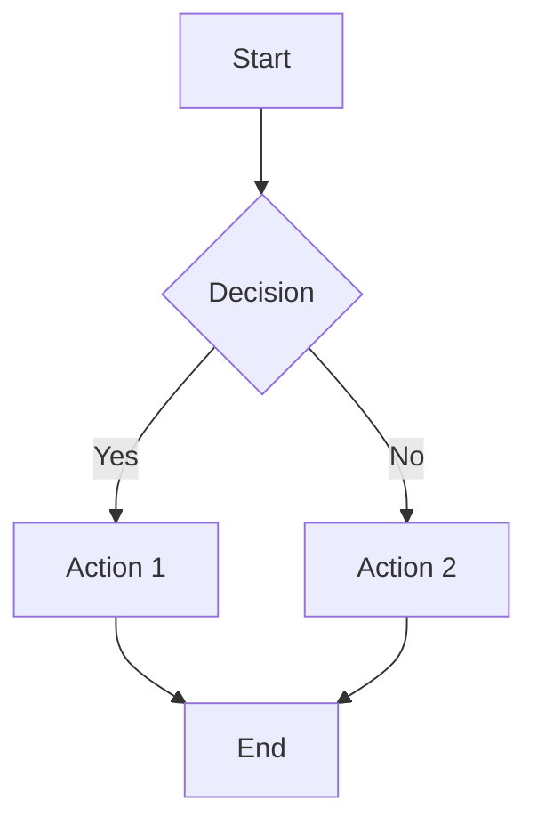

### Sequence Diagram
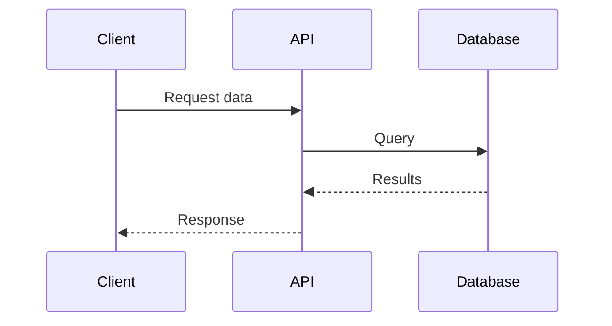

### Class Diagram
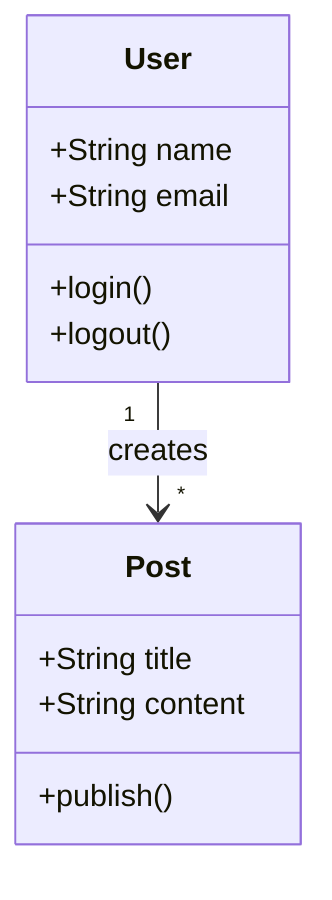

### State Diagram
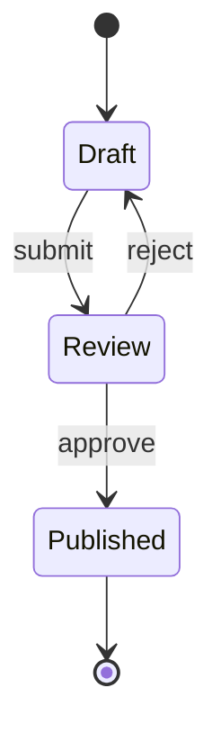

### Entity Relationship Diagram
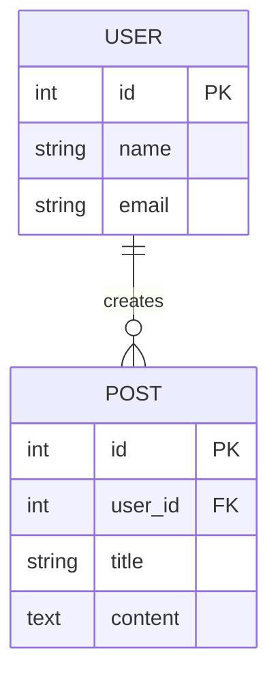

## Best Practices

1. **Keep it Simple**: Start with basic shapes and relationships
2. **Use Descriptive Labels**: Make node names clear and meaningful
3. **Limit Complexity**: Break complex diagrams into multiple smaller ones
4. **Add Context**: Include a brief description above the diagram
5. **Test Rendering**: Verify diagrams render correctly in your target environment

## Common Patterns

### API Flow
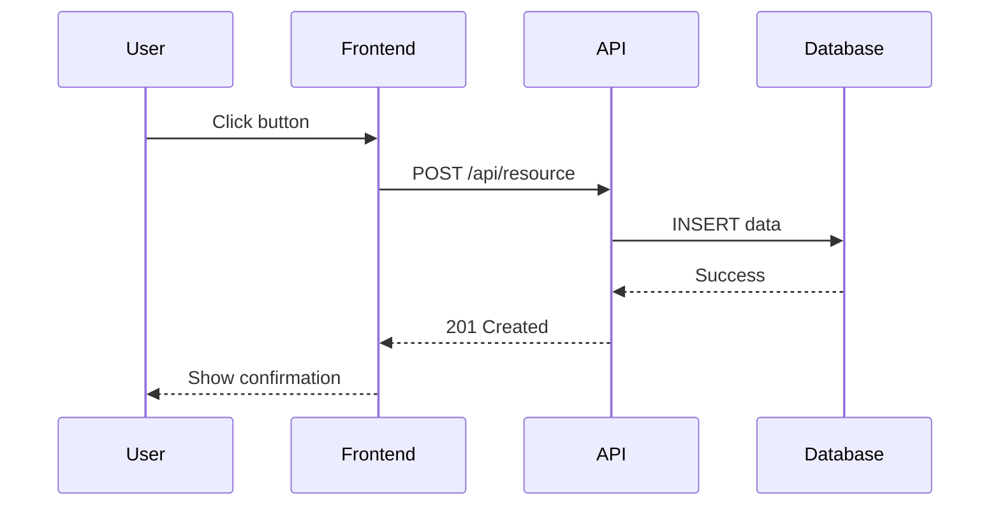

### Decision Flow
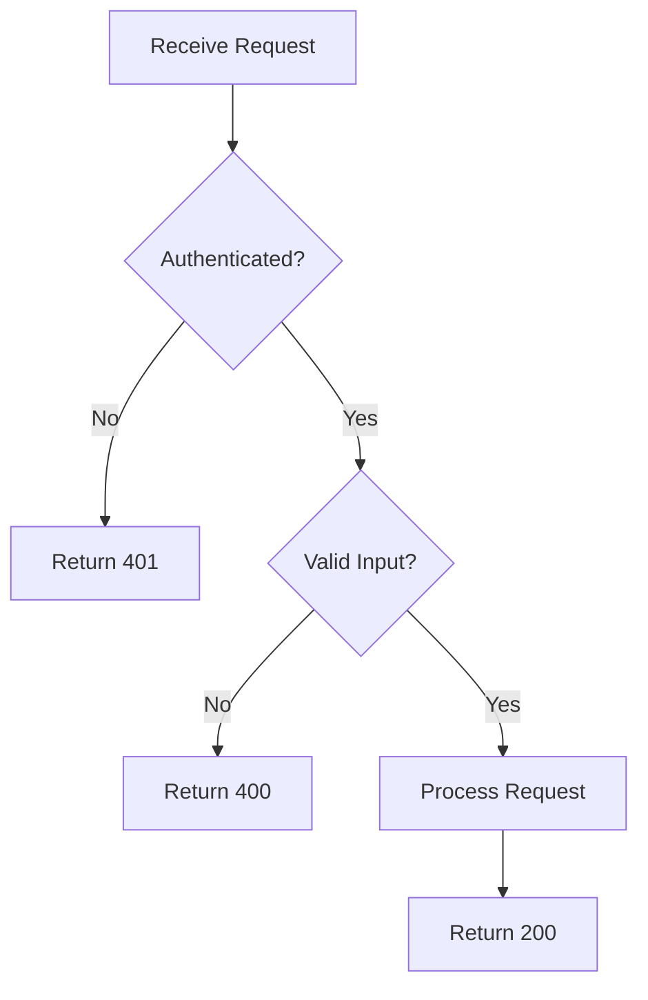

### System Architecture
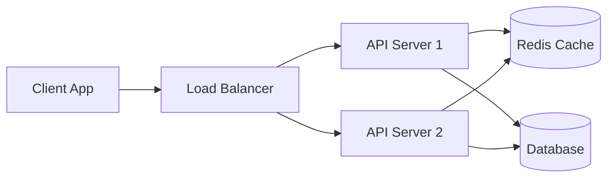

## Syntax Reference

### Node Shapes
- `[Rectangle]` - Basic box
- `(Rounded)` - Rounded edges
- `{Diamond}` - Decision point
- `([Stadium])` - Pill shape
- `[[Subroutine]]` - Double border
- `[(Database)]` - Cylinder
- `((Circle))` - Circle

### Arrow Types
- `-->` - Solid arrow
- `-.->` - Dotted arrow
- `==>` - Thick arrow
- `--text-->` - Labeled arrow
- `---` - Line (no arrow)

### Styling
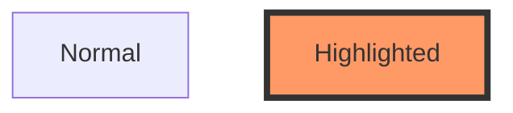

## Tips for Documentation

1. **Inline Diagrams**: Embed directly in documentation for context
2. **Version Control**: Mermaid is text, so it diffs well in git
3. **Collaboration**: Team members can edit without special tools
4. **Automation**: Generate diagrams from code or data
5. **Accessibility**: Add alt text descriptions for screen readers

## Resources

- [Mermaid Official Docs](https://mermaid.js.org/)
- [Live Editor](https://mermaid.live/)
- GitHub/GitLab automatically render Mermaid in markdown

## Tool Usage

When asked to create diagrams:
1. Choose the appropriate Mermaid diagram type
2. **NEVER use parentheses inside labels** - use dashes or commas instead
3. **ALWAYS ensure brackets match** - `[...]`, `{...}`, `(...)`, etc.
4. Use clear, descriptive labels
5. Keep complexity manageable
6. Add a brief description above the diagram
7. Verify syntax is correct (no trailing commas, proper formatting)
