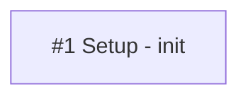
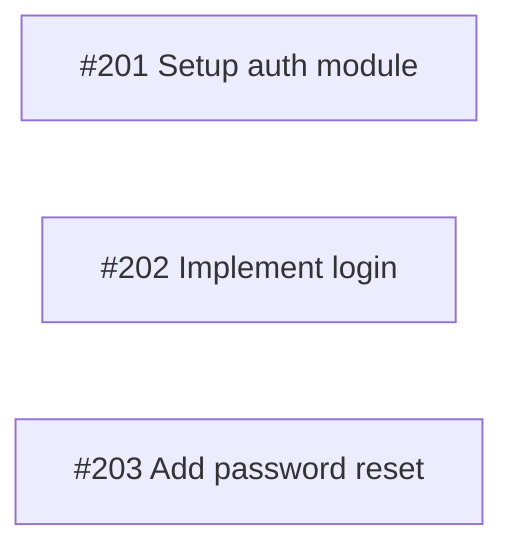
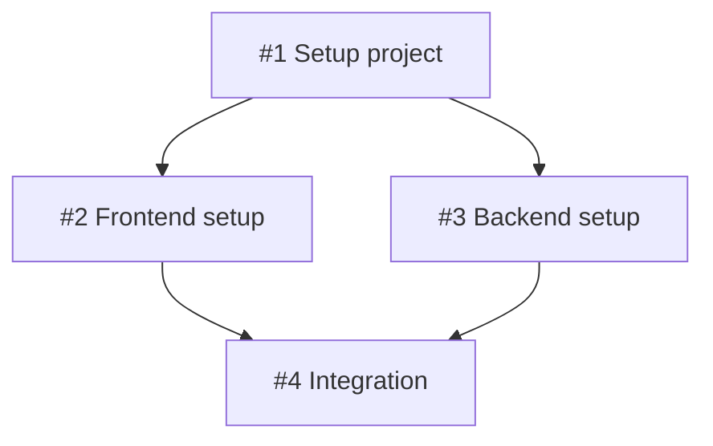
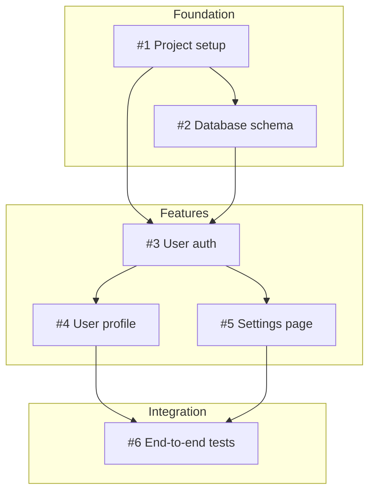
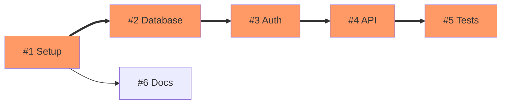
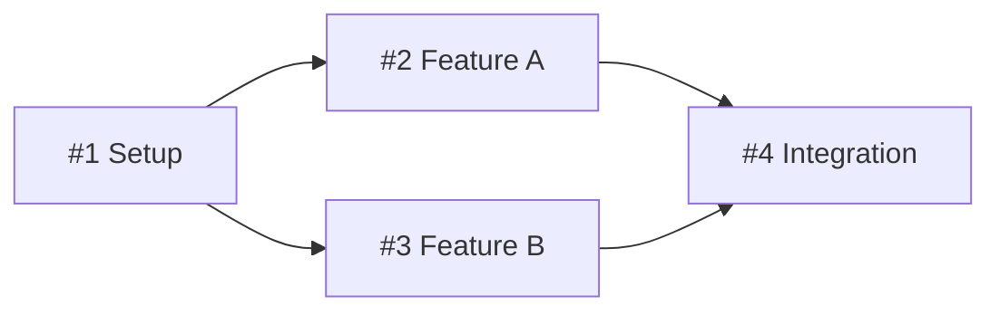
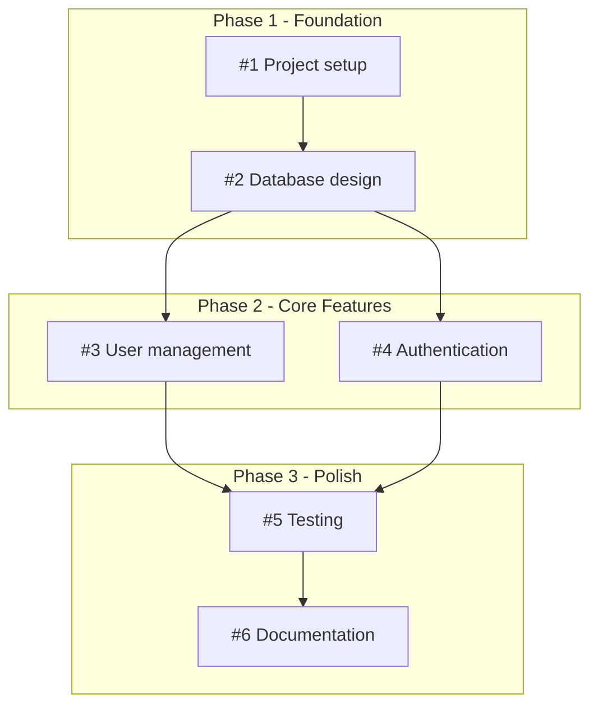
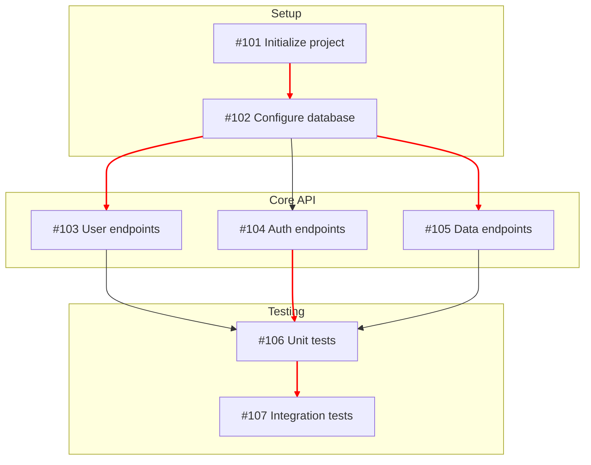

# Dependency Mapping Skill

Generate Mermaid flowcharts that visualize GitHub issue dependencies, blocking relationships, and critical paths through the project.

## When to Use

Activate this skill when:
- User asks "show me the dependencies", "map the issue dependencies"
- User wants to see which issues block others
- During sprint planning to identify critical path
- After issue decomposition to visualize relationships

## Available Tools

| Tool | Purpose |
|------|---------|
| `list_github_issues` | Get all open issues with labels and state |
| `get_github_issue_with_comments` | Get full issue details with body text |
| `search_github_issues` | Find specific issues by criteria |
| `add_note` | Save dependency graph to project notes |

## CRITICAL: Mermaid Syntax Rules

### NEVER use parentheses in node labels

Parentheses break GitHub rendering.

**WRONG:**
```mermaid
flowchart LR
    I1[#1 Setup (init)]
```

**CORRECT:**


### Issue Node Naming Convention

Use consistent naming for issue nodes:



Format: `I<number>[#<number> <short title>]`

## Dependency Graph Patterns

### Linear Dependencies

Issues that must be done in sequence:


### Parallel Work

Issues that can be done simultaneously:



### Complex Dependencies

Multiple blocking relationships:



### Critical Path Highlighting

Emphasize the longest dependency chain:



## Dependency Analysis Process

### Step 1: Gather Issues

Use `list_github_issues` to get all open issues:
- Note issue numbers and titles
- Check for "blocked by" or "depends on" in labels
- Look for dependency keywords in descriptions

### Step 2: Parse Dependencies

Look for dependency indicators:
- **Labels**: `blocked`, `waiting`, `depends-on`
- **Body text**: "Blocked by #X", "Depends on #X", "After #X"
- **Comments**: Discussion about ordering

### Step 3: Build Dependency Map

Create a map of relationships:
```
#201 → blocks → #202, #203
#202 → blocks → #204
#203 → blocks → #204
```

### Step 4: Identify Critical Path

Find the longest chain of dependencies - this is the critical path that determines minimum project duration.

### Step 5: Generate Diagram

Create the Mermaid flowchart with:
- All issues as nodes
- Arrows showing "blocks" direction
- Subgraphs for phases or areas
- Styling for critical path

## Dependency Detection Keywords

Look for these patterns in issue bodies:

| Pattern | Meaning |
|---------|---------|
| "Blocked by #X" | This issue depends on #X |
| "Depends on #X" | This issue depends on #X |
| "After #X" | Do this after #X |
| "Blocks #X" | This issue must complete before #X |
| "Required for #X" | This issue must complete before #X |
| "Prerequisite: #X" | This issue depends on #X |

## Output Format

### Simple Graph



### With Phases



## Arrow Types

| Arrow | Use For |
|-------|---------|
| `-->` | Standard dependency |
| `==>` | Critical path |
| `-.->` | Soft dependency or optional |
| `--text-->` | Labeled relationship |

## Best Practices

1. **Left-to-right for linear** - Use `flowchart LR` for sequential work
2. **Top-to-bottom for complex** - Use `flowchart TB` for many branches
3. **Group by phase** - Use subgraphs for project phases
4. **Highlight critical path** - Use thick arrows and colors
5. **Keep titles short** - Truncate to fit in diagram
6. **Link to issues** - Include issue numbers for reference

## Example Output

For a set of issues about building an API:



## After Generating Graph

- Offer to save the graph to project notes
- Identify the critical path length
- Flag any circular dependencies as errors
- Suggest `timeline-planning` skill for Gantt chart
- Recommend addressing blockers first
