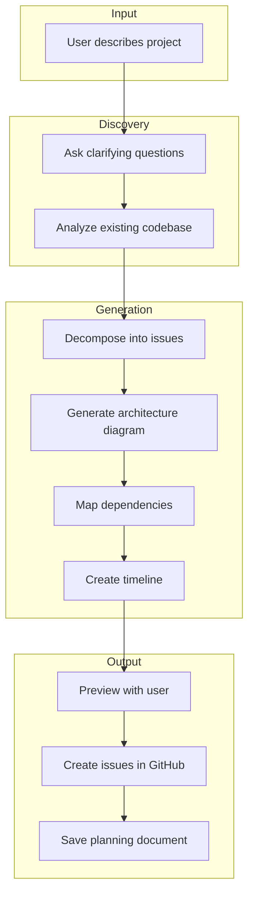

# Project Planning Skill

Orchestrate a comprehensive project planning workflow that generates GitHub issues, architecture diagrams, dependency graphs, and timeline charts from a natural language project description.

## When to Use

Activate this skill when user says:
- "Let's build a project plan for..."
- "Help me plan [project name]"
- "Create a project plan"
- "Break down this project"
- "Help me scope out..."
- "Plan the implementation of..."

## Available Tools

| Tool | Purpose |
|------|---------|
| `create_github_issue` | Create individual issues |
| `list_github_issues` | Check existing issues |
| `add_note` | Save planning artifacts |
| `search_notes` | Find existing plans |
| `read_project_file` | Analyze existing codebase |
| `list_project_directory` | Explore project structure |
| `get_project_scan` | Get project analysis |
| `load_skills` | Load sub-skills for specific tasks |

## Sub-Skills

This skill coordinates four specialized sub-skills:

| Skill | Purpose |
|-------|---------|
| `issue-decomposition` | Break down into GitHub issues |
| `architecture-diagramming` | Generate architecture diagrams |
| `dependency-mapping` | Map issue dependencies |
| `timeline-planning` | Create Gantt charts |

Load these skills as needed during the planning workflow.

## Planning Workflow



### Step 1: Understand the Project

Ask key questions to scope the work:

1. **Project Overview**
   - What is this project/feature?
   - Who are the primary users?
   - What problem does it solve?

2. **Technical Context**
   - What technologies will be used?
   - Are there existing patterns to follow?
   - What external integrations are needed?

3. **Constraints**
   - Any technical requirements or limitations?
   - Dependencies on other work?

### Step 2: Analyze Existing Codebase

If working in an existing project:
- Use `get_project_scan` to understand structure
- Use `read_project_file` to check existing patterns
- Use `list_project_directory` to explore organization

### Step 3: Decompose into Issues

Load `issue-decomposition` skill:
```
load_skills(['issue-decomposition'])
```

Generate 5-15 well-structured issues with:
- User stories
- Acceptance criteria
- Dependencies
- Estimates
- Labels

### Step 4: Generate Architecture Diagram

Load `architecture-diagramming` skill:
```
load_skills(['architecture-diagramming'])
```

Create a Mermaid diagram showing:
- Major components
- Data flow
- External integrations
- Boundaries and layers

### Step 5: Map Dependencies

Load `dependency-mapping` skill:
```
load_skills(['dependency-mapping'])
```

Generate a dependency graph showing:
- Blocking relationships
- Parallel opportunities
- Critical path

### Step 6: Create Timeline

Load `timeline-planning` skill:
```
load_skills(['timeline-planning'])
```

Create a Gantt chart with:
- Phases and milestones
- Task durations
- Dependencies

### Step 7: Preview and Confirm

Before creating anything:

```markdown
## Project Plan Preview

### Issues to Create (X total)
| # | Title | Estimate | Dependencies |
|---|-------|----------|--------------|
| 1 | Setup | Small | None |
| 2 | Core feature | Medium | #1 |
...

### Architecture
[Mermaid diagram]

### Dependencies
[Mermaid diagram]

### Timeline
[Mermaid Gantt]

---
Create these issues and save the plan? (y/n)
```

### Step 8: Create and Save

On confirmation:
1. Create all issues using `create_github_issue`
2. Save planning document to `docs/plans/<slug>-plan.md`
3. Save summary to project notes using `add_note`

## Planning Document Format

Save to `docs/plans/<project-slug>-plan.md`:

```markdown
# Project Plan: [Project Name]

**Generated:** [Date]
**Status:** Draft
**Owner:** @[username]

## Overview
[2-3 sentence summary of the project]

## Goals
- [Goal 1]
- [Goal 2]
- [Goal 3]

## System Architecture

[Mermaid flowchart from architecture-diagramming skill]

## Issue Dependency Graph

[Mermaid flowchart from dependency-mapping skill]

## Timeline

[Mermaid Gantt from timeline-planning skill]

## Risks & Assumptions
- [Risk or assumption 1]
- [Risk or assumption 2]

## Issues Created
| Issue | Title | Status | Estimate |
|-------|-------|--------|----------|
| #201 | [Title] | Open | Small |
| #202 | [Title] | Open | Medium |
...

---
*Generated with LLPM project-planning skill*
```

## Best Practices

1. **Start with understanding** - Don't jump to decomposition
2. **Preview before creating** - Show user the full plan first
3. **Keep issues focused** - One concern per issue
4. **Link everything** - Cross-reference issues, diagrams, notes
5. **Save artifacts** - Store plans for future reference
6. **Iterate if needed** - User can adjust before finalizing

## Example Session

**User**: Let's build a project plan for user authentication

**Assistant**:
1. Asks clarifying questions about auth approach, storage, etc.
2. Loads `issue-decomposition` → generates 7 issues
3. Loads `architecture-diagramming` → creates system diagram
4. Loads `dependency-mapping` → maps issue relationships
5. Loads `timeline-planning` → creates 2-week Gantt chart
6. Shows full preview to user
7. On approval: creates issues, saves plan document

## After Planning

Suggest next steps:
- Assign issues to team members
- Set up project board with columns
- Schedule kickoff meeting
- Review plan with stakeholders

Related skills:
- `stakeholder-tracking` - Track stakeholder goals
- `requirement-elicitation` - Deeper requirements discovery
