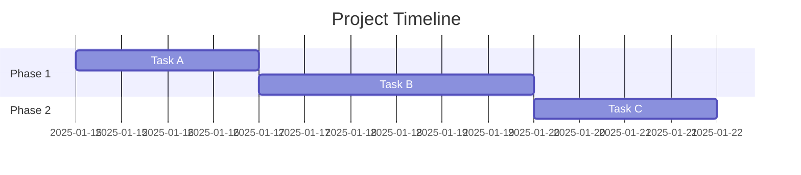
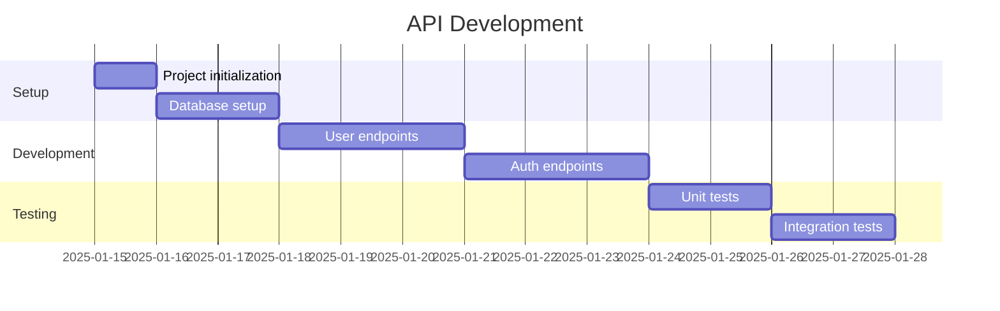
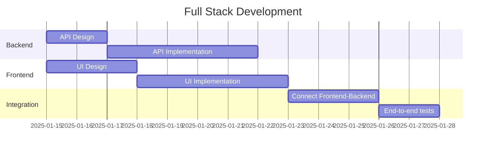
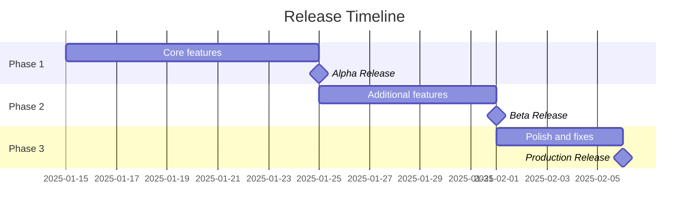
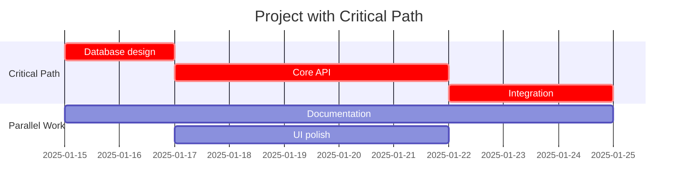
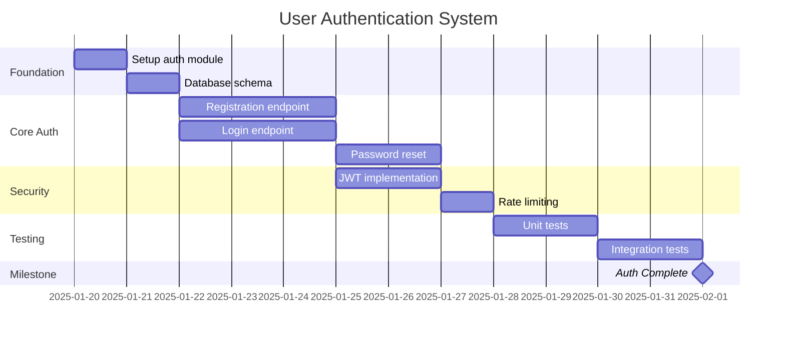

# Timeline Planning Skill

Generate Mermaid Gantt charts that visualize project timelines, task scheduling, phases, and milestones based on GitHub issues and their estimates.

## When to Use

Activate this skill when:
- User asks "what would the timeline look like?"
- User says "create a Gantt chart", "show me the project schedule"
- After issue decomposition to visualize scheduling
- During sprint planning to allocate work

## Available Tools

| Tool | Purpose |
|------|---------|
| `list_github_issues` | Get issues with estimates and dependencies |
| `add_note` | Save timeline to project notes |
| `search_github_issues` | Find specific issues for timeline |

## Mermaid Gantt Syntax

### Basic Structure



### Key Elements

- `title` - Chart title
- `dateFormat` - How dates are parsed
- `section` - Groups related tasks
- Task format: `Name :id, start, duration`

## Estimate to Duration Conversion

Convert T-shirt size estimates to days:

| Estimate | Duration | Notes |
|----------|----------|-------|
| Small | 1d | Single-day task |
| Medium | 3d | Few days of work |
| Large | 5d | Almost a week |
| XL | 8d | Full week+ |

Adjust based on:
- Team velocity
- Complexity indicators
- Buffer for unknowns

## Task States

| Modifier | Meaning | Example |
|----------|---------|---------|
| `done` | Completed | `Task A :done, a, 2025-01-15, 2d` |
| `active` | In progress | `Task B :active, b, after a, 3d` |
| `crit` | Critical path | `Task C :crit, c, after b, 5d` |
| `milestone` | Milestone | `MVP :milestone, m, after c, 0d` |

## Timeline Patterns

### Linear Project



### Parallel Workstreams



### With Milestones



### With Critical Path



## Timeline Generation Process

### Step 1: Gather Issues

Use `list_github_issues` to get:
- Issue titles
- Estimates or labels indicating size
- Dependencies or blocking relationships

### Step 2: Determine Start Date

- Use today's date as default start
- Or ask user for preferred start date
- Consider sprint boundaries

### Step 3: Convert Estimates

Transform issue estimates to durations:
```
#101 [Small] → 1d
#102 [Medium] → 3d
#103 [Large] → 5d
```

### Step 4: Respect Dependencies

Order tasks based on blocking:
```
#101 → start immediately
#102 blocked by #101 → after #101
#103 blocked by #102 → after #102
```

### Step 5: Group into Phases

Organize tasks into logical sections:
- Setup/Foundation
- Core Features
- Testing
- Polish

### Step 6: Generate Gantt Chart

Create the Mermaid syntax with all tasks, dependencies, and phases.

## Date Formats

| Format | Example |
|--------|---------|
| `YYYY-MM-DD` | 2025-01-15 |
| `after id` | after a |
| `Nd` | 3d - duration in days |

## Best Practices

1. **Use sections** - Group related tasks for clarity
2. **Show dependencies** - Use `after id` to chain tasks
3. **Mark milestones** - Highlight key deliverables
4. **Indicate critical path** - Use `:crit` for must-do-first tasks
5. **Keep titles short** - Fit in the chart view
6. **Add buffer** - Include slack for unknowns

## Example Output

For a set of issues about user authentication:



## Handling Edge Cases

### No Estimates

If issues lack estimates:
- Use Medium (3d) as default
- Flag for user to review

### Circular Dependencies

If dependencies form a loop:
- Error and ask user to resolve
- Cannot generate valid timeline

### Too Many Tasks

If > 20 tasks:
- Group into summary tasks
- Suggest breaking into phases

## After Generating Timeline

- Show total project duration
- Identify the end date
- Flag if timeline exceeds any stated deadlines
- Offer to save to project notes
- Suggest adding milestones if missing
